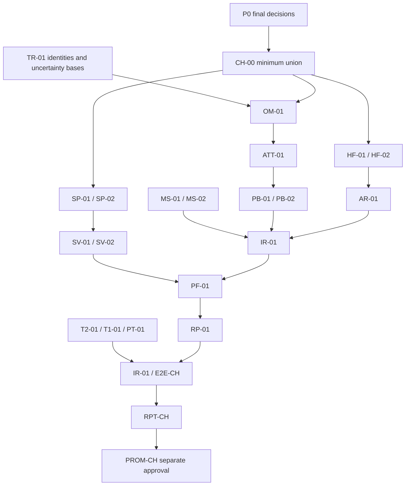

# CH-00 calibration dependency graph

Only stable human-readable campaign, phase, quantity, and artifact identifiers
control dependency resolution. Hash or checksum matching is not a gate.

Incomplete downstream calibration phases are declared dependencies, not
bypasses. CH-00 freezes what must later be linked; it does not promote or
validate their future results.
